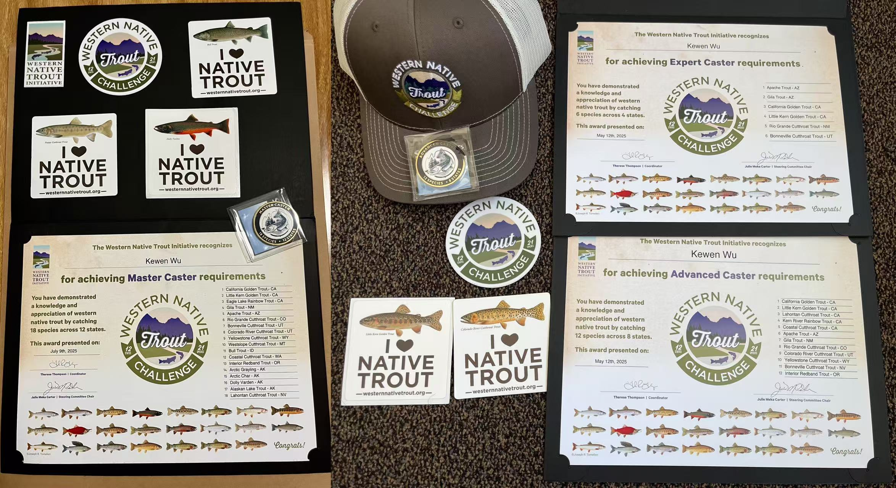
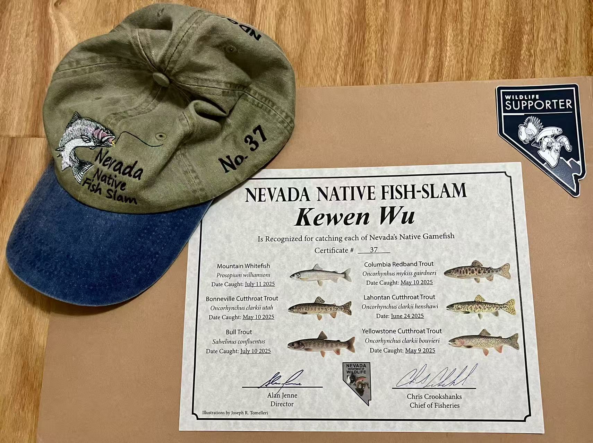
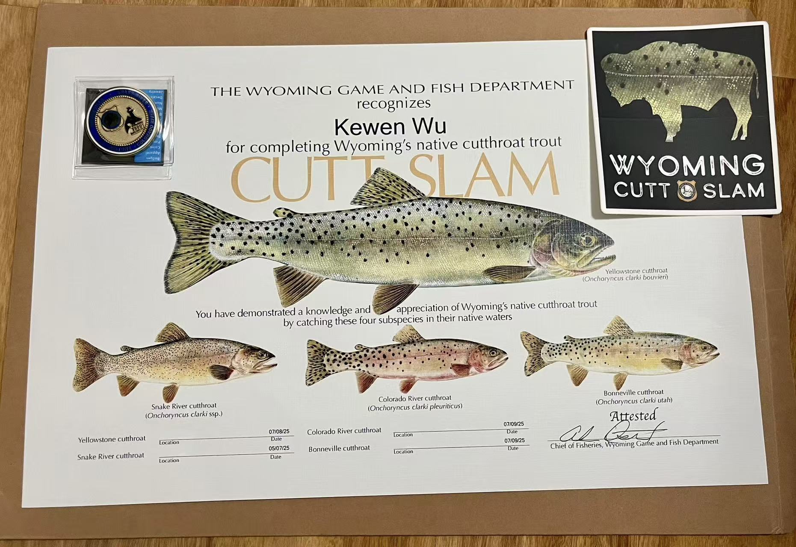
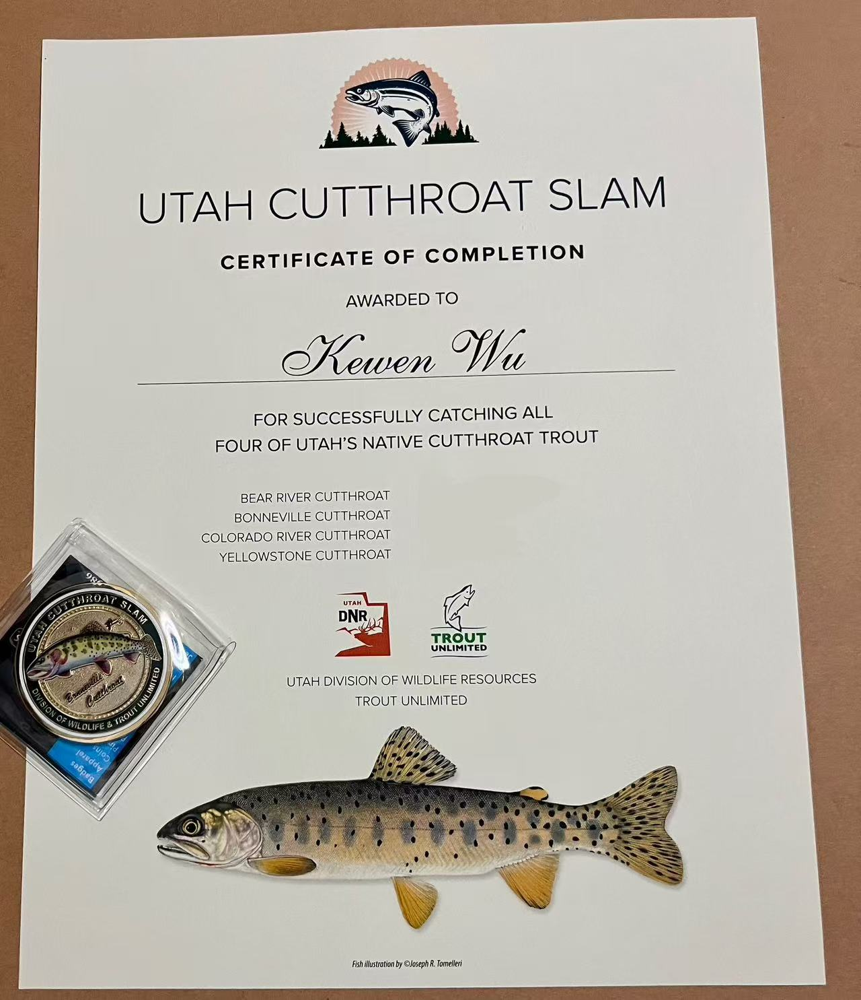

I do all kinds of fishing. I used to put all my fish photos. Since it is getting slower to load, I now only put photos of certificate. Locations of catches are obscured.

<link rel="stylesheet" href="../assets/css/stylesheet.css">
<meta name="viewport" content="width=device-width, initial-scale=1.0">

These are the certificates of [Western Native Trout Challenge](https://westernnativetroutchallenge.org/) and I have completed all 3 levels (Expert Caster, Advanced Caster, and Master Caster) in Summer 2025. See also my name on their [webpage](https://westernnativetroutchallenge.org/completers/).

Photos for this challenge: [Alaskan Lake Trout (Alaska)](../images/fishing/AKLakeTrout_AK.jpg), [Alaskan Rainbow Trout (Alaska)](../images/fishing/AKRainbow_AK.jpg), [Apache Trout (Arizona)](../images/fishing/Apache_AZ.jpg), [Arctic Char (Alaska)](../images/fishing/ArcticChar_AK.jpg), [Arctic Grayling (Alaska)](../images/fishing/Grayling_AK.jpg), [Bonneville Cutthroat Trout (Utah)](../images/fishing/BCT_UT.jpg), [Bull Trout (Idaho)](../images/fishing/BullTrout_ID.jpg), [California Golden Trout (California)](../images/fishing/CAGolden_CA.jpg), [Coastal Cutthroat Trout (Washington)](../images/fishing/CCT_WA.jpg), [Colorado River Cutthroat Trout (Utah)](../images/fishing/CRCT_UT.jpg), [Dolly Varden (Alaska)](../images/fishing/DollyVarden_AK.jpg), [Eagle Lake Rainbow Trout (California)](../images/fishing/EagleLakeRB_CA.jpg), [Gila Trout (New Mexico)](../images/fishing/Gila_NM.jpg), [Kern River Rainbow Trout (California)](../images/fishing/KernRainbow_CA.jpg), [Lahontan Cutthroat Trout (Nevada)](../images/fishing/LCT_NV.jpg), [Little Kern Golden Trout (California)](../images/fishing/LittleKernGolden_CA.jpg), [Paiute Cutthroat Trout (California)](../images/fishing/PCT_CA.jpg), [Redband Trout (Oregon)](../images/fishing/Redband_OR.jpg), [Rio Grande Cutthroat Trout (Colorado)](../images/fishing/RGCT_CO.jpg), [Westslope Cutthroat Trout (Montana)](../images/fishing/WCT_MT.jpg), [Yellowstone Cutthroat Trout (Wyoming)](../images/fishing/YCT_WY.jpg)

   

This is the certificate of [California Heritage Trout Challenge](https://wildlife.ca.gov/Fishing/Inland/HTC) from Fall 2024. I am slowly working on my second one here.

Photos of this challenge: [Coastal Cutthroat Trout](../images/fishing/CCT_CA.jpg), [Lahontan Cutthroat Trout](../images/fishing/LCT_CA.jpg), [Paiute Cutthroat Trout](../images/fishing/PCT_CA.jpg), [Coastal Rainbow Trout](../images/fishing/Rainbow_CA.jpg), [Eagle Lake Rainbow Trout](../images/fishing/EagleLakeRB_CA.jpg), [McCloud River Redband Trout](../images/fishing/McCloudRedband_CA.jpg), [Goose Lake Redband Trout](../images/fishing/GooseRedband_CA.jpg), [Warner Lakes Redband Trout](../images/fishing/WarnerRedband_CA.jpg), [Kern River Rainbow Trout](../images/fishing/KernRainbow_CA.jpg), [California Golden Trout](../images/fishing/CalGolden_CA.jpg), [Little Kern Golden Trout](../images/fishing/LittleKernGolden_CA.jpg)

   

This is the certificate of [Nevada Native Fish-Slam](https://www.ndow.org/get-outside/fishing/angler-recognition-program/) from Summer 2025.

Photos of this challenge: [Bonneville Cutthroat Trout](../images/fishing/BCT_NV.png), [Bull Trout](../images/fishing/BullTrout_NV.jpg), [Lahontan Cutthroat Trout](../images/fishing/LCT_NV.jpg), [Mountain Whitefish](../images/fishing/WhiteFish_NV.jpg), [Redband Trout](../images/fishing/Redband_NV.png), [Yellowstone Cutthroat Trout](../images/fishing/YCT_NV.png)

   

This is the certificate of [Wyoming Cutt-Slam](https://wgfd.wyo.gov/fishing-boating/fishing-challenges/wyoming-cutt-slam) from Summer 2025.

Photos of this challenge: [Bonneville Cutthroat Trout](../images/fishing/BCT_WY.jpg), [Colorado River Cutthroat Trout](../images/fishing/CRCT_WY.jpg), [Snake River Cutthroat Trout](../images/fishing/SRCT_WY.jpg), [Yellowstone Cutthroat Trout](../images/fishing/YCT_WY.jpg)

   

This is the certificate of [Utah Cutthroat Slam](https://www.utahcutthroatslam.org/) from Summer 2025.

Photos of this challenge: [Bonneville Cutthroat Trout](../images/fishing/BCT_UT.jpg), [Colorado River Cutthroat Trout](../images/fishing/CRCT_UT.jpg), [Yellowstone Cutthroat Trout](../images/fishing/YCT_UT.jpg), [Bear River Cutthroat Trout](../images/fishing/BRCT_UT.jpg)

   

Photos of other catches:
[California Halibut](../images/fishing/california_halibut.jpg), [American Shad](../images/fishing/american_shad.jpg), [Lingcod](../images/fishing/lingcod.jpg), [Pacific Sanddab](../images/fishing/pacific_sanddab.jpg), [Mexican Rockfish](../images/fishing/mexican_rockfish.jpg), [Chilipepper Rockfish](../images/fishing/chilipepper_rockfish.jpg), [Greenspotted Rockfish](../images/fishing/greenspotted_rockfish.jpg), [Greenstriped Rockfish](../images/fishing/greenstriped_rockfish.jpg), [Starry Rockfish](../images/fishing/starry_rockfish.jpg), [Yelloweye Rockfish (Juvenile)](../images/fishing/yelloweye_rockfish_juvenile.jpg), [Bocaccio](../images/fishing/bocaccio.jpg), [Marble Trout](../images/fishing/marble_trout.jpg), [Brook Trout](../images/fishing/brook_trout.jpg), [Brown Trout](../images/fishing/brown_trout.jpg), [White Crappie](../images/fishing/white_crappie.jpg), [Black Crappie](../images/fishing/black_crappie.jpg), [Mountain Whitefish](../images/fishing/mountain_whitefish.jpg), [Eagle Lake Tui Chub](../images/fishing/eagle_lake_tui_chub.jpg), [Largemouth Bass](../images/fishing/largemouth_bass.jpg), [Smallmouth Bass](../images/fishing/smallmouth_bass.jpg), [Striped Bass](../images/fishing/striped_bass.jpg), [Shiner Perch](../images/fishing/shiner_perch.jpg), [Buffalo Sculpin](../images/fishing/buffalo_sculpin.jpg), [Round Goby](../images/fishing/round_goby.jpg), [Brown Rockfish](../images/fishing/brown_rockfish.jpg), [Vermilion Rockfish](../images/fishing/vermilion_rockfish.jpg), [China Rockfish](../images/fishing/china_rockfish.jpg), [Blue Rockfish](../images/fishing/blue_rockfish.jpg), [Gopher Rockfish](../images/fishing/gopher_rockfish.jpg), [Jacksmelt](../images/fishing/jacksmelt.jpg), [Jack Mackerel](../images/fishing/jack_mackerel.jpg), [Grass Rockfish](../images/fishing/grass_rockfish.jpg), [Monkeyface Prickleback](../images/fishing/monkeyface_prickleback.jpg), [Redtail Perch](../images/fishing/redtail_perch.jpg), [Bluegill](../images/fishing/bluegill.jpg), [Redear Sunfish](../images/fishing/redear_sunfish.jpg), [Bat Ray](../images/fishing/bat_ray.jpg), [Kelp Grenling (Male)](../images/fishing/kelp_greenling_male.jpg), [Striped Seaperch](../images/fishing/striped_seaperch.jpg), [Calico Surfperch](../images/fishing/calico_surfperch.jpg), [Barred Surfperch](../images/fishing/barred_surfperch.jpg), [Walleye Surfperch](../images/fishing/walleye_surfperch.jpg), [Black Perch](../images/fishing/black_perch.jpg), [Leopard Shark](../images/fishing/leopard_shark.jpg), [White Croaker](../images/fishing/white_croaker.jpg), [Channel Catfish](../images/fishing/channel_catfish.jpg), [Cabezon](../images/fishing/cabezon.jpg), [Speckled Scallop](../images/fishing/speckled_scallop.jpg), [Geoduck Clam](../images/fishing/geoduck_clam.jpg), [Razor Clam](../images/fishing/razor_clam.jpg), [Littleneck Clam](../images/fishing/littleneck_clam.jpg), [Nuttall Cockle](../images/fishing/nuttall_cockle.jpg), [Manila Clam](../images/fishing/manila_clam.jpg), [Gaper Clam](../images/fishing/gaper_clam.jpg), [Washington Clam](../images/fishing/washington_clam.jpg), [Limpet](../images/fishing/limpet.jpg), [Bull Frog](../images/fishing/bull_frog.jpg), [Moon Snail](../images/fishing/moon_snail.jpg), [California Sea Cucumber](../images/fishing/california_sea_cucumber.jpg), [Purple Sea Urchin](../images/fishing/purple_urchin.jpg), [Sea Slug](../images/fishing/sea_slug.jpg), [Octopus](../images/fishing/octopus.jpg), [Brittle Stars](../images/fishing/brittle_stars.jpg), [Dungeness Crab](../images/fishing/dungeness_crab.jpg), [Pacific Mole Crab](../images/fishing/pacific_mole_crab.jpg), [Kelp Crab](../images/fishing/kelp_crab.jpg), [Shore Crab](../images/fishing/shore_crab.jpg), [Pea Crab](../images/fishing/pea_crab.jpg), [Yellow Rock Crab](../images/fishing/yellow_rock_crab.jpg), [Pacific RockCrab](../images/fishing/pacific_rock_crab.jpg), [Swimming Crab](../images/fishing/swimming_crab.jpg), [Slender Crab](../images/fishing/slender_crab.jpg), [European Green Crab](../images/fishing/european_green_crab.jpg), [Spiny Lobster](../images/fishing/spiny_lobster.jpg), [Ghost Shrimp](../images/fishing/ghost_shrimp.jpg), [Red Rock Crab](../images/fishing/red_rock_crab.jpg)
