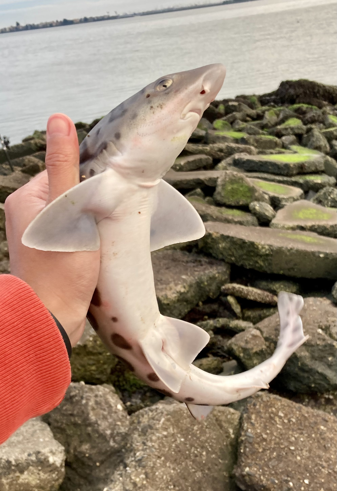
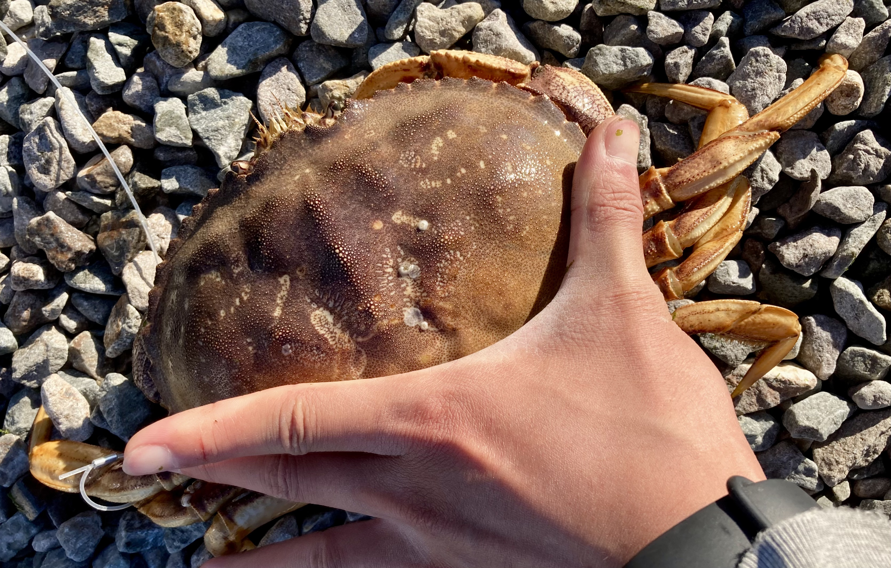

If you go out with me and see me drifted away by current or killed by poisonous fish, or more likely, eaten by *Kraken* or recruited by *Flying Dutchman*, please let my other friends know :)

<link rel="stylesheet" href="../assets/css/stylesheet.css">
<meta name="viewport" content="width=device-width, initial-scale=1.0">

  

    
    

      <h1_hover>Leopard Shark</h1_hover>
      
Dec/21/2021

      
Shorebird Park, Berkeley, CA, US

    

  

  

    
    

      <h1_hover>Croaker</h1_hover>
      
Dec/4/2021

      
Mavericks Beach, Half Moon Bay, CA, US

    

  

  

    
    

      <h1_hover>Catfish</h1_hover>
      
Nov/27/2021

      
Lafayette Reservoir Recreation, Lafayette, CA, US

    

  

  

    
    

      <h1_hover>Dungeness Crab</h1_hover>
      
Nov/25/2021

      
Ocean Beach, San Francisco, CA, US

    

  

  

    
    

      <h1_hover>Pacific Mole Crab</h1_hover>
      
Nov/25/2021

      
Ocean Beach, San Francisco, CA, US

    

  

  

    
    

      <h1_hover>Kelp Crab</h1_hover>
      
Nov/20/2021

      
Mavericks Beach, Half Moon Bay, CA, US

    

  

  

    
    

      <h1_hover>Rock Crab</h1_hover>
      
Nov/20/2021

      
Mavericks Beach, Half Moon Bay, CA, US

    

  

  

    
    

      <h1_hover>Shore Crab</h1_hover>
      
Nov/20/2021

      
Mavericks Beach, Half Moon Bay, CA, US

    

  

  

    
    

      <h1_hover>Purple Urchin</h1_hover>
      
Nov/6/2021

      
Mavericks Beach, Half Moon Bay, CA, US

    

  

  

    
    

      <h1_hover>Surfperch</h1_hover>
      
Oct/31/2021

      
Black Sands Beach, Sausalito, CA, US

    

  

  

    
    

      <h1_hover>Cabezon</h1_hover>
      
Oct/31/2021

      
Black Sands Beach, Sausalito, CA, US

    

  

  

    
    

      <h1_hover>Largemouth Bass</h1_hover>
      
Oct/15/2021

      
Clear Lake, Lake County, CA, US

    

  

  

    
    

      <h1_hover>Jacksmelt</h1_hover>
      
Sept/9/2021

      
Shorebird Park, Berkeley, CA, US

    

  

